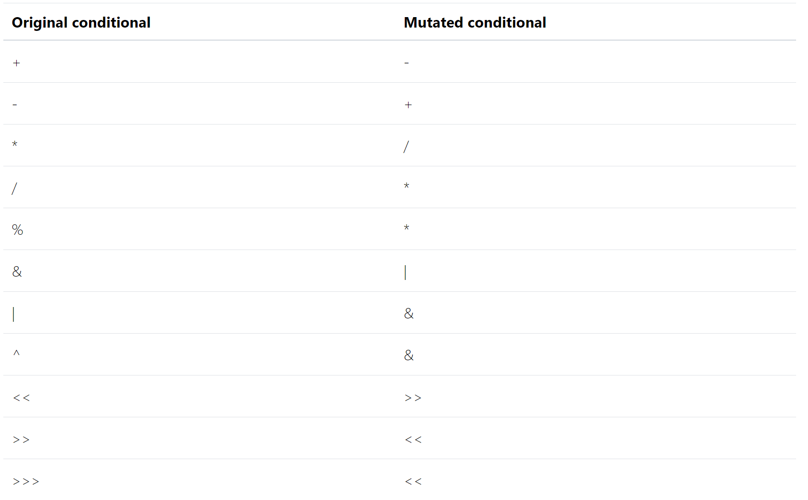

# CS453 Assignment 4: Mutation Testing Tool for Python

## Overview

With this assignment, we will try implementing a basic mutation testing tool for Python that can mutate the source code, run given `pytest` test suites, report changed behaviour, and generate kill matrices. The skeleton code, called `pmut.py`, specifies the required functionalities. For example, assume that the project you want to apply mutation testing to is scored under directory `examples/example1`. When you invoke `pmut.py` as follows:

```bash
$ python pmut.py --action mutate --source examples/example1 --mutants ./mutation_diffs
```

it should apply mutation operators to all files under `examples/example1`, one mutation to one location in one file at a time, and generate mutants under `./mutation_diffs`. You should generate each mutant as a diff against the original program, instrumented by the command line `diff` command. Each diff file should be named using the following naming convention:

```
[target_filename]_[mutation_operator]_[line_number]_[index].diff
```
**If a mutation operator can generate multiple mutants from the same line in the same file**, sort the mutated line alphabetically and index them from 0 (use two digits, e.g., 00, 01, 02...). If there is only a single mutant, the index is naturally 0.

## Mutation Operators

You should implement the following mutation operators at the minimum:

### Conditionals Boundary Mutator (CONDITIONALS-BOUNDARY)

`CONDITIONALS-BOUNDARY` replaces relational operators according to the table below.


For example, given the following code:
```python
#example.py

def foo(a, b, c):
    if (a < b):
        return a
    if (b > c):
        return b
```

your tool should yield the following diffs:

example_CONDITIONALS-BOUNDARY_02_00.diff:
```
2c2
<     if (a < b):
---
>     if (a <= b):
```

example_CONDITIONALS-BOUNDARY_04_00.diff:
```
4c4
<     if (b > c):
---
>     if (b >= c):
```
### Increments Mutator (INCREMENTS)

`INCREMENTS` replaces assignment increments with assignment decrements and vice versa.

For example, given the following code:
```
#example1.py

def foo(a):
    x = 3
    for i in range(a):
        x += 3
```

your tool should yield following diff:

example1_INCREMENTS_04_00.diff:
```
4c4
<       x += 3
---
>       x -= 3:
```

### Invert Negatives Mutator (INVERT-NEGS)

`INVERT-NEGS` inverts unary negations.

For example, given the following code:
```
#example2.py

def foo(a, b):
    x = -3 + 4 * (a - b)
    return x
```

your tool should yield following diffs:

example2_INVERT-NEGS_02_00.diff:
```
2c2
<   x = -3 + 4 * (a - b)
---
>   x = 3 + 4 * (a - b)
```

### Math Mutator (MATH)

`MATH` replaces binary arithmetic operators according to the table below:


For example, given the following code:
```
#example2.py

def foo(a, b):
    x = -3 + 4 * (a - b)
    return x
```

your tool should yield following diffs:

example2_MATH_02_00.diff:
```
2c2
<   x = -3 + 4 * (a - b)
---
>   x = -3 - 4 * (a - b)
```

example2_MATH_02_01.diff:
```
2c2
<   x = -3 + 4 * (a - b)
---
>   x = -3 + 4 / (a - b)
```

example2_MATH_02_02.diff:
```
2c2
<   x = -3 + 4 * (a - b)
---
>   x = -3 + 4 * (a + b)
```

### Negate Conditionals Mutator (NEGATE-CONDITIONALS)

`NEGATE-CONDITIONALS` should replace all conditionals according to the table below:


For example, given the following code:
```
#example.py

def foo(a, b, c):
    if (a < b):
        return a
    if (b > c):
        return b
```

your tool should yield the following diffs:

example_NEGATE-CONDITIONALS_02_00.diff:
```
2c2
<     if (a < b):
---
>     if (a >= b):
```

example_NEGATE-CONDITIONALS_04_00.diff:
```
4c4
<     if (b > c):
---
>     if (b <= c):
```

### False returns Mutator (FALSE-RETURNS)

`FALSE-RETURNS` should replace return values with `False`.

For example, given the following code:
```
#example.py

def foo(a, b, c):
    if (a < b):
        return a
    if (b > c):
        return b
```

your tool should yield following diffs:

example_FALSE-RETURNS_03_00.diff:
```
3c3
<       return a
---
>       return False
```

example_FALSE-RETURNS_05_00.diff:
```
5c5
<       return a
---
>       return False
```

### True returns Mutator (TRUE-RETURNS)

`TRUE-RETURNS` should replace return values with `True`.

For example, given the following code:
```
#example.py

def foo(a, b, c):
    if (a < b):
        return a
    if (b > c):
        return b
```

your tool should yield the following diffs:

example_TRUE-RETURNS_03_00.diff:
```
3c3
<       return a
---
>       return True
```
example_TRUE-RETURNS_05_00.diff:
```
5c5
<       return b
---
>       return True
```

### Null returns Mutator (NULL-RETURNS)

`NULL-RETURNS` should replace return values with `None`.

For example, given the following code:
```
#example.py

def foo(a, b, c):
    if (a < b):
        return a
    if (b > c):
        return b
```

your tool should yield the following diffs:

example_NULL-RETURNS_03_00.diff:
```
3c3
<       return a
---
>       return None
```

example_NULL-RETURNS_05_00.diff:
```
5c5
<       return b
---
>       return None
```
### Bitwise Operator Mutator (OBBN)

`OBBN` consists of three sub-mutators OBBN1, OBBN2, and OBBN3 that respectively reverse bitwise operators, replace a bitwise operation by its first member, and by its second member.

For example, given the following code:
```
example3.py

def foo(a, b):
    return a & b
```

your tool should yield following diffs:

example3_OBBN1_02_00.diff:
```
2c2
<   return a & b
---
>   return a | b
```

example3_OBBN2_02_00.diff:
```
2c2
<   return a & b
---
>   return a
```

example3_OBBN3_02_00.diff:
```
2c2
<   return a & b
---
>   return b
```
### Constant Replacement Mutator (CRCR)

`CRCR` mutates inline constant. The mutator is composed of 6 sub-mutators (CRCR1 to CRCR6) that mutate constants according to the table below.


For example, given the following code:
```
#example1.py

def foo(a):
    x = 3
    for i in range(a):
        x += 3
```

your tool should yield following diffs:

example1_CRCR1_02_00.diff:
```
2c2
<   x = 3
---
>   x = 1
```

example1_CRCR2_02_00.diff:
```
2c2
<   x = 3
---
>   x = 0
```

example1_CRCR3_02_00.diff:
```
2c2
<   x = 3
---
>   x = -1
```

example1_CRCR4_02_00.diff:
```
2c2
<   x = 3
---
>   x = -3
```

example1_CRCR5_02_00.diff:
```
2c2
<   x = 3
---
>   x = 3 + 1
```

example1_CRCR6_02_00.diff:
```
2c2
<   x = 3
---
>   x = 3 - 1
```

## Skeleton and Test Code

This repository includes a skeleton code named `pmut.py` for your profiler. Please keep the existing code and the command line interface as provided, so that GitHub Classroom can run the automated grading scripts. 

The tool should operate in two different action modes, specified by the parameter `action`. Its value can be either `mutate`, or `execute`.

1. Mutation mode (`--action = mutate`)

```bash
$ python pmut.py --action mutate --source [source directory] --mutants [mutation diff directory]
Total number of mutated files: XXX
Total number of mutants generated: XXX
$ 
```
The tool should mutate whatever it finds under the source directory, and save the resulting mutation diff patches under the mutation diff directory: when saving patches, use the naming convention specified above. After mutation, the tool should report the number of mutants generated.


2. Execution mode (`--action = execute`)
```bash
$ python pmut.py --action execute --source [source directory] --kill [kill matrix directory]
Total test functions found: XXX
Total killed mutants: XXX
Mutation Score: XX.XX% (XX / XX)
```
The tool should execute the `pytest` test cases for all mutants in the source directory one by one, and write the output to the kill matrix directory. If you opt to, you may use the `--mutants` flag to reuse mutants generated in the `--action mutate` phase. It should also print out three lines of information about mutant executions: total test functions, total killed mutants, and the mutation score, down to two digits below decimal point.

In the kill matrix directory, there should be three files:

- Test Case Index File (`test_index.json`): this file should contain the dictionary of test case name to kill matrix row index. Use `[test function name]@[pytest file name without .py]` naming convention for dictionary keys.
- Mutant Index File (`mutation_index.json`): this file should contain the dictionary of mutant name to kill matrix column index. Use the same mutant naming sonvention for dictionary keys.
- Kill Matrix File (`kill_matrix.np`): this file should be a `numpy` array of type `int32`, whose size is [number of test cases] by [number of mutants]. The array should be saved using the [`savetxt`](https://numpy.org/doc/stable/reference/generated/numpy.savetxt.html#numpy.savetxt) function in `numpy`: 1 corresponds to the corresponding mutant (column index) killed by the corresponding test case (row index), and 0 otherwise.

Note that a mutant is killed if a test that passes when executed with the original program fails with the mutant program. **At the end of the execution, the source directory should be reverted back to the original state.**

## Libraries and Python Version

The template repository is configured with Python 3.10. `numpy` is used to write the kill matrix.

## Bonus Goal

Implement a test input generator that does the following:

- It takes a Python source code, which contains a program written using the subset of Python we used for Assignment 3, and a mutation diff file generated by your mutation testing tool for this assignment: the input generation should be based on symbolic execution.
- The goal of the bonus test input generator is 1) to generate a test input that can **strongly** kill the given mutant (i.e., the original code + the mutation diff) in the form of a PyTest testcase, or 2) to say the mutant is equivalent if it cannot be killed.

The input generator should be implemented under the name `pmutkiller.py`. The command line interface is left up to you: if you have achieved this, you should provide the following:

- A dedicated section in your report that describes the approach you took, including how the tool can be used
- An example of a mutant that can be killed (i.e., a program, a mutation diff, and an instruction of how to use the tool to generate the PyTest case)
- - An example of an equivalent mutant that CANNOT be killed (i.e., a program, a mutation diff, and an instruction of how to use the tool to generate the PyTest case)

For this goal, you will have to reuse/extend your solution for Assignment 3. Use the Z3 SMT Solver as in Assignment 3. If correctly and sufficiently impleented, you will be given 10% of the course grade as bonus.

### Report

In addition to the implementation, submit a brief report as part of the repository. Name the file `report.pdf` in the root directory of the assignment repository. The report should contain the following:

- A brief description of the problem in your own understanding
- How you designed your solution
- Any unique idea/technique that you think you contributed to the implementation
- A brief summary of what you've learnt